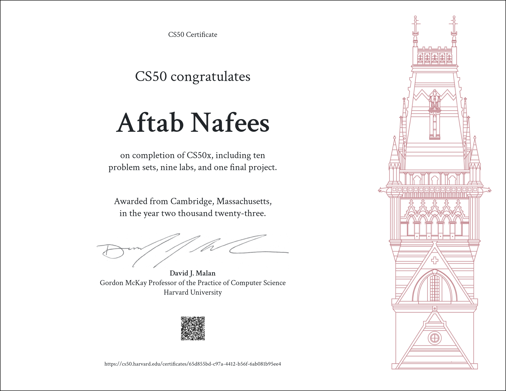

## CS50: Introduction to Computer Science
I made this repository to post my solutions for the problems of Harvard University Course CS50:Introduction to Computer Science 2023.
You can find the materials for this course <a href='https://cs50.harvard.edu/x/2020/'>here</a>.
Hope this is helpful to other students, if you don't mind please leave a star!
Every exercise in this repository scored 100% on submission.

## Table of Contents
- <a href= 'https://cs50.harvard.edu/x/2023/weeks/0/'>Week 0: Scratch</a>
  * <a href= 'https://cs50.harvard.edu/x/2023/psets/0/'>Problem Set 0</a>
    + [Scratch (Collect Basketball.sb3)](scratch)
- <a href= 'https://cs50.harvard.edu/x/2023/weeks/1/'>Week 1: C</a>
  * <a href= 'https://cs50.harvard.edu/x/2023/labs/1/'>Lab 1</a>
    + [Population Growth](population)
  * <a href= 'https://cs50.harvard.edu/x/2023/psets/1/'>Problem Set 1</a>
    + [Hello](hello)
    + [Mario-less](mario-less)
    + [Mario-More](mario-more)
    + [Cash](cash)
- <a href= 'https://cs50.harvard.edu/x/2023/weeks/2/'>Week 2: Arrays</a>
  * <a href= 'https://cs50.harvard.edu/x/2023/labs/2/'>Lab 2</a>
    + [Scrabble](scrabble)
  * <a href= 'https://cs50.harvard.edu/x/2023/psets/2/'>Problem Set 2</a>
    + [Readability](readability)
    + [Bulbs](bulbs)
- <a href= 'https://cs50.harvard.edu/x/2023/weeks/3/'>Week 3: Algorithms</a>
  * <a href= 'https://cs50.harvard.edu/x/2023/labs/3/'>Lab 3</a>
    + [Sort](sort)
  * <a href= 'https://cs50.harvard.edu/x/2023/psets/3/'>Problem Set 3</a>
    + [Plurality](plurality)
    + [Runoff](runoff)
- <a href= 'https://cs50.harvard.edu/x/2023/weeks/4/'>Week 4: Memory</a>
  * <a href= 'https://cs50.harvard.edu/x/2023/labs/4/'>Lab 4</a>
    + [Smiley](smiley)
  * <a href= 'https://cs50.harvard.edu/x/2023/psets/4/'>Problem Set 4</a>
    + [Filter-less](filter-less)
    + [Reverse](reverse)
- <a href= 'https://cs50.harvard.edu/x/2023/weeks/5/'>Week 5: Data Structures</a>
  * <a href= 'https://cs50.harvard.edu/x/2023/labs/5/'>Lab 5</a>
    + [Inheritance](inheritance)
  * <a href= 'https://cs50.harvard.edu/x/2023/psets/5/'>Problem Set 5</a>
    + [Speller](speller)
- <a href= 'https://cs50.harvard.edu/x/2023/weeks/6/'>Week 6: Python</a>
  * <a href= 'https://cs50.harvard.edu/x/2023/labs/6/'>Lab 6</a>
    + [World Cup](world-cup)
  * <a href= 'https://cs50.harvard.edu/x/2023/psets/6/'>Problem Set 6</a>
    + [Sentimental Hello](sentimental-hello)
    + [Sentimental Mario Less](sentimental-mario-less)
    + [Sentimental Cash](sentimental-cash)
    + [Sentimental Readability](sentimental-readability)
- <a href= 'https://cs50.harvard.edu/x/2023/weeks/7/'>Week 7: SQL</a>
  * <a href= 'https://cs50.harvard.edu/x/2023/labs/7/'>Lab 7</a>
    + [Songs](songs)
  * <a href= 'https://cs50.harvard.edu/x/2023/psets/7/'>Problem Set 7</a>
    + [Movies](movies)
    + [Fiftyville](fiftyville)
- <a href= 'https://cs50.harvard.edu/x/2023/weeks/8/'>Week 8: HTML, CSS, JavaScript</a>
  * <a href= 'https://cs50.harvard.edu/x/2023/labs/8/'>Lab 8</a>
    + [Trivia](trivia)
  * <a href= 'https://cs50.harvard.edu/x/2023/psets/8/'>Problem Set 8</a>
    + [Homepage](homepage)
- <a href= 'https://cs50.harvard.edu/x/2023/weeks/9/'>Week 9: Flasks</a>
  * <a href= 'https://cs50.harvard.edu/x/2023/labs/9/'>Lab 9</a>
    + [Birthdays](birthdays)
  * <a href= 'https://cs50.harvard.edu/x/2023/psets/9/'>Problem Set 9</a>
    + [Finance](finance)
- <a href= 'https://cs50.harvard.edu/x/2023/project/'>Final Project: </a>
  * [Project (Quiz App)](final-project)

### Final Certificate!

### DISCLAIMER:
Please don't just copy the code mindlessly without trying to solve the problems yourself, it's totally pointless if you actually wanna learn how to write software and a blatant violation of the [**Academic Honesty**](https://docs.cs50.net/2016/fall/syllabus/cs50.html#academic-honesty) policy of the course.

